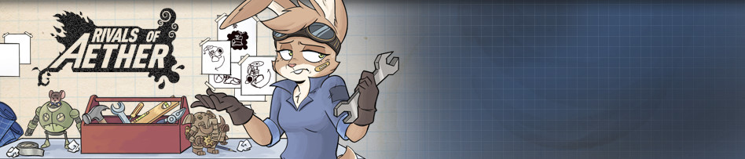

## Tools ##

If you’d like to create your own workshop characters, we recommend you use [this blank character template](https://rivalsofaether.com/wp-content/uploads/2020/02/WorkshopCharacterTemplate-1.zip) to start out. We also recommend [GMEdit](https://yellowafterlife.itch.io/gmedit) as your code editor for Rivals Workshop characters. This program was recently updated to specifically include support for Rivals Steam Workshop. To access this beta version with Rivals dialect support:

*   [Install the Beta Version of GMEdit](https://yellowafterlife.itch.io/gmedit)
*   [Download the roa.zip support files](https://rivalsofaether.com/wp-content/uploads/2019/02/roa.zip)
*   Extract roa.zip into the GML dialects directory as per [https://github.com/GameMakerDiscord/GMEdit/wiki/GML-dialects#installing-dialects](https://github.com/GameMakerDiscord/GMEdit/wiki/GML-dialects#installing-dialects)

### File Structure ###

A great place to start is by taking a look at the two example characters we created. [Sandbert](https://steamcommunity.com/workshop/filedetails/?id=1865940669) is a good example of a simple character while [Guadua](https://steamcommunity.com/sharedfiles/filedetails/?id=1866016173) goes deeper with some more exotic moves and designs.

Workshop characters and stages that you are working on need their files placed within your Rivals AppData folder. Files stored locally in this working directory can even be updated during a match by pressing “F5” to apply your latest changes.

Workshop items that you subscribe to and download from the Steam Workshop are located elsewhere. To find workshop content that you’ve downloaded from Steam and move a copy into your working directory, search within:

`C:\\Program Files (x86)\\Steam\\steamapps\\workshop\\content\\383980`

and copy the character folder here:

`C:\\Users\\{Your Account}\\AppData\\Local\\RivalsofAether\\workshop`

or stage folder here:

`C:\\Users\\{Your Account}\\AppData\\Local\\RivalsofAether\\stages`

### Workshop Item Elements ###

If your steam library is installed in an area that’s not the default, you can also do a search for the Rivals app ID (383980) to find Steam’s Workshop download folder. If done correctly you should now see the additional content in your game. An item itself should be packed inside a folder and should contain the following files:

*  ` config.ini` – a file with all general info about your item. [Read more→](/code/config_ini)
*   `/scripts` folder with all the custom scripts in `.gml` format. [Read more→](https://www.rivalsofaether.com/workshop/scripts)
*   `/sprites` folder with all custom images in `.png` format. [Read more→](https://www.rivalsofaether.com/workshop/sprites)
*   `/sounds` folder with all custom sounds in `.ogg` format. [Read more→](https://www.rivalsofaether.com/workshop/sounds)
*   `charselect.png` \[102x72px\] – a preview for the in-game character select menu, usually with the character facing right
*   `hud.png` \[48x32px\] – used in the bottom HUD during gameplay
*   `hurt.png` \[48x32px\] – used in the bottom HUD while being launched
*   `icon.png` \[15x15px\] – used for the in-game workshop items list and various HUDs
*   `offscreen.png` \[34x34px\] – used when the player is offscreen. Use [this template](https://www.rivalsofaether.com/wp-content/uploads/2019/08/offscreen.png) to make it fit inside the offscreen indicator
*   `portrait.png` \[350x350px\] – large portrait showed on Steam workshop page and on the after-match results screen
*   `preview.png` \[any size, but 16:9 aspect ratio, 960×540 recommended\] – used in the preview window on the Steam Workshop website
*   `result_small.png` \[79x31px\] – usually a cropped, flipped (to face left) version of charselect.png. Used in the results screen
